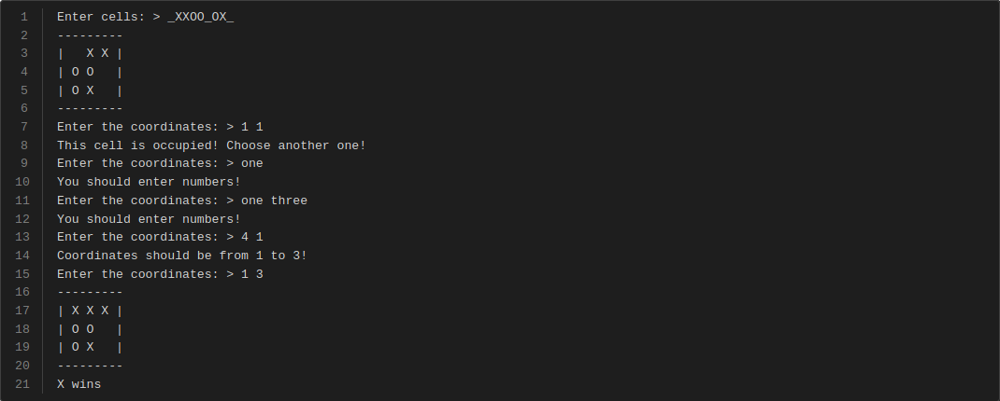

# Tic-Tac-Toe with AI

-----

## Description

The initial configuration of the board should be provided. The program asks to enter the coordinates where the user wants to make a move. Then, it determines the state of match.

## Example

The example below shows how the program works.
The greater-than symbol followed by space (`> `) represents the user input. Notice that it's not the part of the input.
